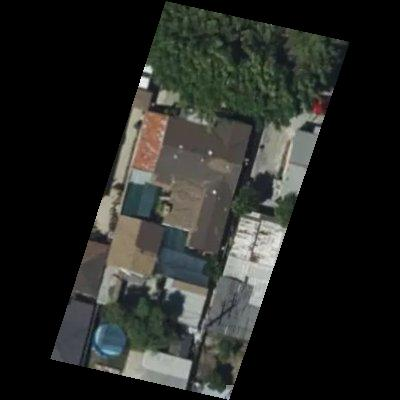

# Swimming Pool Classifier

A deep learning project that uses transfer learning to classify whether a home has a swimming pool based on satellite imagery. This project was submitted as part of the CS4619 assignment in January 2025 as part of Computer Science at University College Cork.

## Overview

This project implements a computer vision classifier that can detect the presence of swimming pools in residential properties in Los Angeles County using satellite imagery. The model leverages transfer learning with pre-trained architectures including ResNet50, Xception, and InceptionV3 from Keras.

## Project Structure

```
pool_classifier/
├── data/
│   └── parcels.geojson    # Converted parcel boundaries
├── get_images.py         # Script to fetch and process satellite images
├── model_training.ipynb  # Jupyter notebook for model training
├── model_demo.ipynb      # Jupyter notebook for model testing
└── best_network.keras    # Trained model weights
```

## Data Collection and Processing

### Step 1: Parcel Data

- Download the geodatabase of home parcels and their boundaries from [LA County Data Portal](https://data.lacounty.gov/documents/4d67b154ae614d219c58535659128e71/about) (omitted from repository due to filesize)
- Convert the shapefile to GeoJSON using ogr2ogr:
  ```bash
  ogr2ogr -f GeoJSON -t_srs crs:84 data/parcels.geojson LACounty_Parcels.shp
  ```

### Step 2: Satellite Imagery

- Use the Mapbox API to fetch satellite images of the properties
- Apply masks to show only property boundaries
- Process images using `get_images.py`
- Note: The full image dataset is not included in the repository due to size constraints



### Step 3: Dataset Preparation

- Manually curated dataset of 400 images:
  - 200 images with swimming pools
  - 200 images without swimming pools
- Split into training, testing, and validation sets

## Model Training

The model training process is documented in `model_training.ipynb`:

- Implements transfer learning using pre-trained models
- Fine-tunes on the swimming pool classification task
- Saves the best performing model as `best_network.keras`

## Model Testing

The trained model can be tested using `model_demo.ipynb`, which includes:

- Example predictions on new images
- Performance evaluation
- Visualization of results
